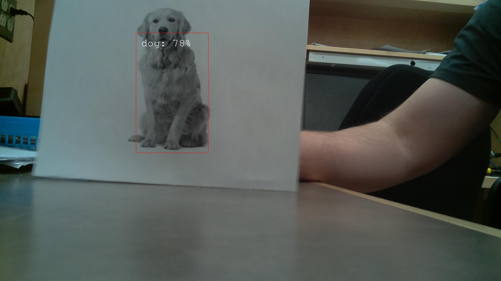

# Dev Tasks
[x] Auto launch watchdog on startup with shell script: watchdogAutostart.sh

[x] Get config file from server, else use local file: conf_json.json

[x] Load either yolov2 or yolov2 tiny model via conf_json tiny value: model_configs.py or model_tiny_configs.py

[x] Take image based on time interval: /pics/sampleDog.jpg

[x] Send notification to server if a specific class is identified in the image. 200 is the sucessfull response code.

- Darknet-Yolo https://pjreddie.com/darknet/yolo/
- Recognition script based off breeko/spypy

# Install Notes
- Make sure to use python2.7 (not python 3!, Tensorflow is not compatable on pi for 3+)
- Run watchdog.py, install dependencies with pip as needed
- Run download_weights.sh to get weights (large files not normally stored on git)
- Update watchdogAutostart.h with the location of your virtual env to activate
- Edit your "/etc/xdg/lxsession/LXDE/autostart.txt" with "@/pathtomyscript/myscript.sh" to run on startup
