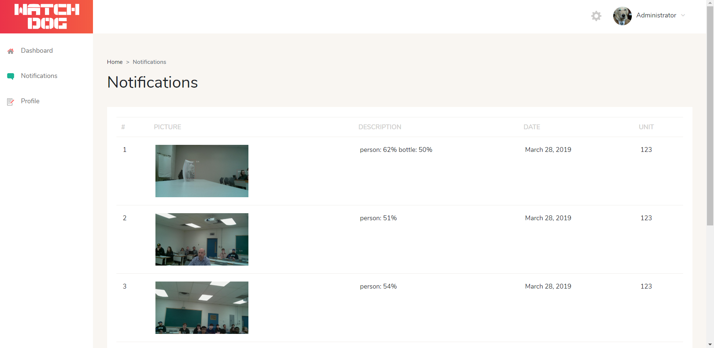
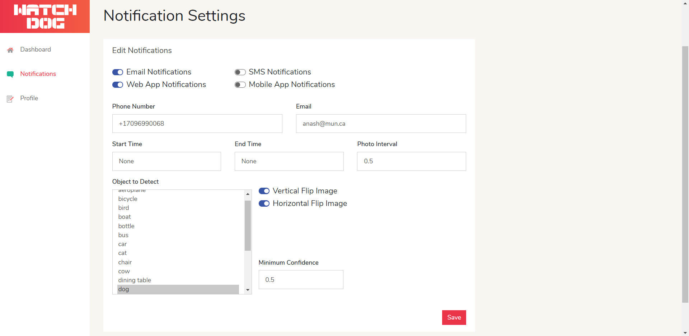
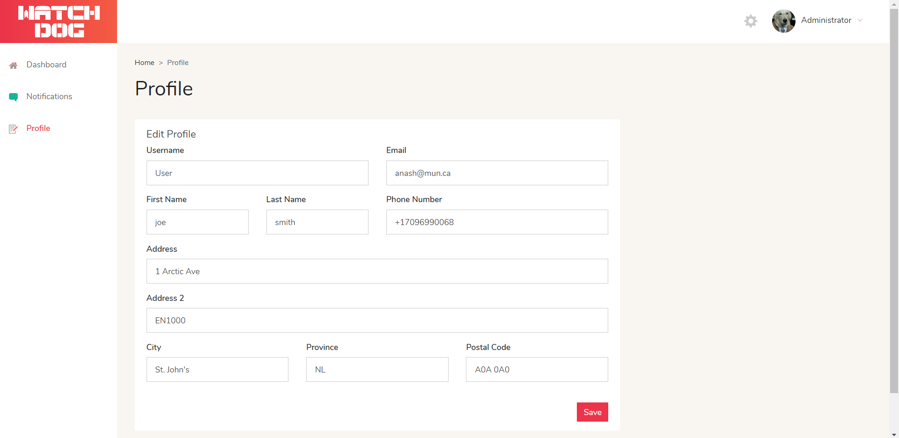

## Watchdog React Dashboard — An "[isomorphic](http://nerds.airbnb.com/isomorphic-javascript-future-web-apps/)" Web App

### Requirements

  * Mac OS X, Windows, or Linux
  * [Yarn](https://yarnpkg.com/) package manager + [Node.js](https://nodejs.org/) v6.5 or newer
  * Text editor or IDE pre-configured with React/JSX/Flow/ESlint ([learn more](./how-to-configure-text-editors.md))

## Quick Start

#### 1. Get the latest version

After you have made sure you have installed all the above requirments. You can start by cloning the latest version of watchdog on your
local machine by running:

```shell
$ git clone -o react-dashboard -b master --single-branch \
      https://github.com/stuckatmarine/watchdog.git watchdog
$ cd watchdog/webApp
```

#### 2. Run `yarn install`

This will install both run-time project dependencies and developer tools listed
in [package.json](../package.json) file.

#### 3. Run `yarn start`

This command will build the app from the source files (`/src`) into the output
`/build` folder. As soon as the initial build completes, it will start the
Node.js server (`node build/server.js`) and [Browsersync](https://browsersync.io/)
with [HMR](https://webpack.github.io/docs/hot-module-replacement) on top of it.

> [http://localhost:3000/](http://localhost:3000/) — Node.js server (`build/server.js`)<br>
> [http://localhost:3000/graphql](http://localhost:3000/graphql) — GraphQL server and IDE<br>

Now you can open your web app in a browser, on mobile devices and start
hacking. Whenever you modify any of the source files inside the `/src` folder,
the module bundler ([Webpack](http://webpack.github.io/)) will recompile the
app on the fly and refresh all the connected browsers.

For more info please refer to [getting started](./docs/getting-started.md) guide to download and run the project (Node.js >= 6.5)

### Directory Layout

Before you start, take a moment to see how the project structure looks like:

```
.
├── /build/                     # The folder for compiled output
├── /docs/                      # Documentation files for the project
├── /node_modules/              # 3rd-party libraries and utilities
├── /public/                    # Static files which are copied into the /build/public folder
├── /src/                       # The source code of the application
│   ├── /components/            # React components
│   ├── /data/                  # GraphQL server schema and data models
│   ├── /routes/                # Page/screen components along with the routing information
│   ├── /client.js              # Client-side startup script
│   ├── /config.js              # Global application settings
│   ├── /server.js              # Server-side startup script
│   └── ...                     # Other core framework modules
├── /test/                      # Unit and end-to-end tests
├── /tools/                     # Build automation scripts and utilities
│   ├── /lib/                   # Library for utility snippets
│   ├── /build.js               # Builds the project from source to output (build) folder
│   ├── /bundle.js              # Bundles the web resources into package(s) through Webpack
│   ├── /clean.js               # Cleans up the output (build) folder
│   ├── /copy.js                # Copies static files to output (build) folder
│   ├── /deploy.js              # Deploys your web application
│   ├── /postcss.config.js      # Configuration for transforming styles with PostCSS plugins
│   ├── /run.js                 # Helper function for running build automation tasks
│   ├── /runServer.js           # Launches (or restarts) Node.js server
│   ├── /start.js               # Launches the development web server with "live reload"
│   └── /webpack.config.js      # Configurations for client-side and server-side bundles
├── Dockerfile                  # Commands for building a Docker image for production
├── package.json                # The list of 3rd party libraries and utilities
└── yarn.lock                   # Fixed versions of all the dependencies
```

## Screenshots

### Dashboard


### Notification Settings


### User Profile



## Built using 
* [React](https://facebook.github.io/react/)
* [Bootstrap](http://getbootstrap.com/)
* [React Router](https://reacttraining.com/react-router/) (with **Server Side Rendering**!),
* [Redux](http://redux.js.org/)
* [GraphQL](http://graphql.org/)

This project is bootstraped from [Flatlogic](https://github.com/flatlogic/react-dashboard), which is a seed project of a free version of a template that may be found on [Themeforest](https://themeforest.net/category/site-templates/admin-templates)
or [Wrapbootstrap](https://wrapbootstrap.com/themes/admin) with working backend integration.

## Features
* React
* Server Side Rendering
* Mobile friendly layout (responsive)
* React Router
* Bootstrap3
* GraphQL
* Nodejs backend inegration
* Sass styles
* Webpack build
* Stylish, clean, responsive layout
* Lots of utility css classes for rapid development (flatlogic css set)
* Authentication
* CRUD operations examples
* Browsersync for the ease of development

## Sub-Licenses

[MIT](https://github.com/flatlogic/react-dashboard/blob/master/LICENSE.txt) and another [MIT](https://github.com/flatlogic/react-dashboard/blob/master/LICENSE-react-starter-kit.txt) from RSK.
